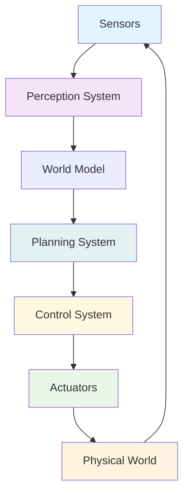

# Physical AI System Architecture

## Architecture Overview

This diagram illustrates the flow of information and control in a typical Physical AI system, showing how sensors, perception, planning, control, and actuators work together.

### Components Explained

#### Sensors
- **LiDAR**: Provides 3D point cloud data for environment mapping
- **Cameras**: Capture visual information for object recognition
- **IMU**: Measures orientation, acceleration, and angular velocity
- **Force/Torque Sensors**: Detect interaction forces during manipulation
- **Other Sensors**: GPS, ultrasonic, tactile, etc.

#### Perception System
- **Object Detection**: Identifies and classifies objects in the environment
- **SLAM (Simultaneous Localization and Mapping)**: Creates maps while determining robot position
- **Sensor Fusion**: Combines data from multiple sensors for robust perception
- **State Estimation**: Determines the current state of the robot and environment

#### World Model
- **Environment Representation**: Maintains a model of the known environment
- **Robot State**: Tracks the robot's current configuration and status
- **Dynamic Objects**: Models moving objects and predicts their behavior
- **Uncertainty Management**: Handles uncertainty in perception and environment state

#### Planning System
- **Path Planning**: Determines safe routes through the environment
- **Motion Planning**: Plans detailed movements for robot actuators
- **Task Planning**: Breaks down high-level goals into executable actions
- **Behavior Selection**: Chooses appropriate behaviors based on context

#### Control System
- **Trajectory Execution**: Converts planned paths into actuator commands
- **Feedback Control**: Adjusts commands based on sensor feedback
- **Safety Monitoring**: Ensures actions are safe and within limits
- **Adaptive Control**: Adjusts control parameters based on environment

#### Actuators
- **Motors**: Drive robot joints and wheels
- **Grippers**: Manipulate objects in the environment
- **Displays**: Provide visual feedback to humans
- **Speakers**: Enable audio communication

#### Physical World
- **Environment**: The real-world space where the robot operates
- **Objects**: Items that the robot can interact with
- **Humans**: People with whom the robot may interact
- **Obstacles**: Things to be avoided or navigated around

## Key Principles

1. **Closed-Loop Operation**: Information flows continuously from sensors through processing to actuators and back to sensors
2. **Real-Time Processing**: All components must operate within strict timing constraints
3. **Robustness**: Systems must handle uncertainty, noise, and unexpected situations
4. **Safety**: Built-in safety mechanisms prevent harmful actions
5. **Adaptability**: Systems must adapt to changing environments and tasks

This architecture represents the fundamental structure of most Physical AI systems, from simple mobile robots to complex humanoid platforms. Understanding these components and their interactions is essential for developing effective robotic applications.