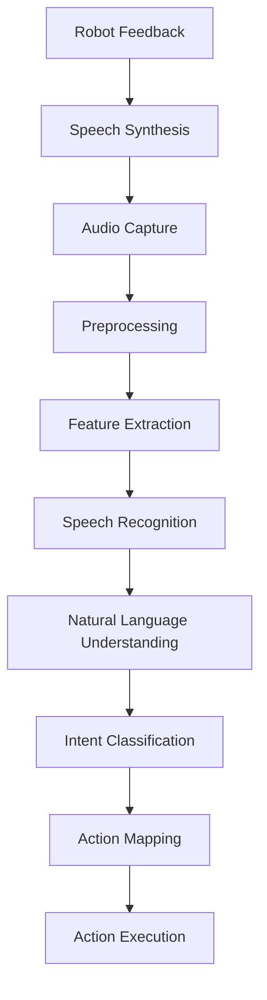

# Voice-to-Action Pipeline

## Introduction to Voice Processing for Robotics

Voice-to-action pipelines are critical for creating natural, intuitive interactions between humans and robots. These systems convert spoken language into executable robot commands, enabling users to control robots using natural speech patterns. This chapter explores the complete pipeline from audio capture to robot action execution.

## Architecture of Voice-to-Action Systems

The voice-to-action pipeline typically consists of several stages:



## Audio Capture and Preprocessing

The first stage of the pipeline involves capturing high-quality audio and preprocessing it for recognition:

```python
import pyaudio
import numpy as np
import scipy.signal as signal
import webrtcvad
import collections
import threading
import queue

class AudioCapture:
    def __init__(self, sample_rate=16000, chunk_size=1024, channels=1):
        """
        Initialize audio capture system

        Args:
            sample_rate: Audio sampling rate (Hz)
            chunk_size: Size of audio chunks to process
            channels: Number of audio channels (1 for mono)
        """
        self.sample_rate = sample_rate
        self.chunk_size = chunk_size
        self.channels = channels
        self.format = pyaudio.paInt16
        self.audio = pyaudio.PyAudio()

        # Voice activity detection
        self.vad = webrtcvad.Vad(2)  # Aggressiveness mode 2
        self.ring_buffer = collections.deque(maxlen=30)  # 300ms at 10ms frame
        self.triggered = False
        self.vad_frames = []
        self.ring_buffer_count = 0
        self.timeout_count = 0
        self.speech_start = 0

        # Audio processing queue
        self.audio_queue = queue.Queue()
        self.listening = False

    def start_capture(self):
        """Start audio capture in a separate thread"""
        self.listening = True
        self.capture_thread = threading.Thread(target=self._capture_loop)
        self.capture_thread.start()

    def stop_capture(self):
        """Stop audio capture"""
        self.listening = False
        if hasattr(self, 'capture_thread'):
            self.capture_thread.join()

    def _capture_loop(self):
        """Main capture loop"""
        stream = self.audio.open(
            format=self.format,
            channels=self.channels,
            rate=self.sample_rate,
            input=True,
            frames_per_buffer=self.chunk_size
        )

        while self.listening:
            audio_chunk = stream.read(self.chunk_size, exception_on_overflow=False)
            self.audio_queue.put(audio_chunk)

        stream.stop_stream()
        stream.close()

    def get_audio_chunk(self):
        """Get the next audio chunk from the queue"""
        try:
            return self.audio_queue.get(timeout=1)
        except queue.Empty:
            return None

    def preprocess_audio(self, audio_data):
        """
        Preprocess audio data for better recognition

        Args:
            audio_data: Raw audio data as bytes

        Returns:
            Processed audio data as numpy array
        """
        # Convert bytes to numpy array
        audio_array = np.frombuffer(audio_data, dtype=np.int16)

        # Normalize audio
        audio_array = audio_array.astype(np.float32) / 32768.0

        # Apply noise reduction (simple spectral subtraction)
        # Calculate the mean of the first 1000 samples as noise estimate
        if len(audio_array) > 1000:
            noise_floor = np.mean(np.abs(audio_array[:1000]))
            audio_array = np.where(np.abs(audio_array) > noise_floor * 2,
                                 audio_array, 0)

        # Apply a simple high-pass filter to remove low-frequency noise
        b, a = signal.butter(3, 0.01, btype='high')
        audio_array = signal.filtfilt(b, a, audio_array)

        return audio_array

    def detect_voice_activity(self, audio_chunk):
        """
        Detect voice activity in audio chunk using WebRTC VAD

        Args:
            audio_chunk: Audio chunk as bytes

        Returns:
            True if voice activity detected, False otherwise
        """
        # WebRTC VAD requires 10, 20, or 30 ms frames
        frame_duration = 20  # ms
        frame_size = int(self.sample_rate * frame_duration / 1000 * 2)  # 2 bytes per sample

        # Split chunk into VAD-appropriate frames
        frames = [audio_chunk[i:i+frame_size] for i in range(0, len(audio_chunk), frame_size)]

        for frame in frames:
            if len(frame) == frame_size:  # Only process complete frames
                is_speech = self.vad.is_speech(frame, self.sample_rate)
                if is_speech:
                    return True
        return False

class VoiceActivityDetector:
    def __init__(self, sample_rate=16000):
        """
        Advanced voice activity detection with state management
        """
        self.sample_rate = sample_rate
        self.vad = webrtcvad.Vad(2)
        self.frame_duration = 30  # ms
        self.frame_size = int(self.sample_rate * self.frame_duration / 1000 * 2)
        self.ring_buffer = collections.deque(maxlen=30)  # 300ms buffer
        self.triggered = False
        self.vad_frames = []
        self.ring_buffer_count = 0
        self.timeout_count = 0
        self.speech_start = 0

    def is_speech_detected(self, audio_chunk):
        """
        Detect speech with hysteresis to reduce false triggers
        """
        # Split into frames
        frames = [audio_chunk[i:i+self.frame_size]
                 for i in range(0, len(audio_chunk), self.frame_size)]

        for i, frame in enumerate(frames):
            if len(frame) == self.frame_size:
                is_speech = self.vad.is_speech(frame, self.sample_rate)

                if not self.triggered:
                    # Not in speech state
                    self.ring_buffer.append((frame, is_speech))
                    num_voiced = len([f for f, speech in self.ring_buffer if speech])

                    if num_voiced > 0.5 * self.ring_buffer.maxlen:
                        self.triggered = True
                        self.ring_buffer_count = 0
                        self.speech_start = i
                        # Clear ring buffer to start collecting speech
                        self.vad_frames.extend([f for f, _ in self.ring_buffer])
                        self.ring_buffer.clear()
                else:
                    # In speech state
                    if is_speech:
                        self.vad_frames.append(frame)
                        self.ring_buffer_count = 0
                    else:
                        self.ring_buffer_count += 1
                        if self.ring_buffer_count > 10:  # 300ms timeout
                            self.triggered = False
                            speech_data = b''.join(self.vad_frames)
                            self.vad_frames = []
                            return speech_data

        return None
```

## Speech Recognition Integration

Now let's implement the speech recognition component that converts audio to text:

```python
import speech_recognition as sr
import threading
import queue
import time

class SpeechRecognizer:
    def __init__(self, language='en-US', energy_threshold=300):
        """
        Initialize speech recognition system

        Args:
            language: Language for recognition (e.g., 'en-US', 'es-ES')
            energy_threshold: Minimum audio energy to consider for recording
        """
        self.recognizer = sr.Recognizer()
        self.recognizer.energy_threshold = energy_threshold
        self.recognizer.dynamic_energy_threshold = True
        self.language = language

        # Online recognition (Google)
        self.online_recognizer = sr.Recognizer()

        # Offline recognition (if needed)
        # You can also use pocketsphinx or other offline engines
        self.offline_enabled = False

        # Recognition queue
        self.recognition_queue = queue.Queue()
        self.results_queue = queue.Queue()

    def recognize_speech(self, audio_data, use_offline=False):
        """
        Recognize speech from audio data

        Args:
            audio_data: Audio data as bytes
            use_offline: Whether to use offline recognition

        Returns:
            Recognized text or None if recognition failed
        """
        # Convert audio bytes to AudioData object
        audio = sr.AudioData(audio_data, self.recognizer.sample_rate,
                           self.recognizer.sample_width)

        try:
            if use_offline and self.offline_enabled:
                # Use offline recognition
                text = self.recognizer.recognize_sphinx(audio)
            else:
                # Use online recognition (Google)
                text = self.recognizer.recognize_google(audio, language=self.language)

            return text
        except sr.UnknownValueError:
            return None
        except sr.RequestError as e:
            print(f"Speech recognition error: {e}")
            return None

    def continuous_recognition(self, audio_capture, callback_func):
        """
        Perform continuous speech recognition

        Args:
            audio_capture: AudioCapture instance
            callback_func: Function to call with recognized text
        """
        vad_detector = VoiceActivityDetector(sample_rate=audio_capture.sample_rate)

        while audio_capture.listening:
            audio_chunk = audio_capture.get_audio_chunk()
            if audio_chunk is None:
                continue

            # Detect speech activity
            speech_data = vad_detector.is_speech_detected(audio_chunk)

            if speech_data is not None:
                # Process the speech data
                recognized_text = self.recognize_speech(speech_data)

                if recognized_text:
                    callback_func(recognized_text)
                    print(f"Recognized: {recognized_text}")

class KeywordSpotter:
    def __init__(self, keywords, threshold=0.7):
        """
        Simple keyword spotting for wake word detection

        Args:
            keywords: List of keywords to spot
            threshold: Confidence threshold for keyword detection
        """
        self.keywords = [kw.lower() for kw in keywords]
        self.threshold = threshold

    def spot_keywords(self, text):
        """
        Check if any keywords are present in the text

        Args:
            text: Input text to check

        Returns:
            List of detected keywords
        """
        detected = []
        text_lower = text.lower()

        for keyword in self.keywords:
            if keyword in text_lower:
                detected.append(keyword)

        return detected

    def is_wake_word_detected(self, text):
        """
        Check if wake word is detected in text
        """
        return len(self.spot_keywords(text)) > 0
```

## Natural Language Understanding

The natural language understanding (NLU) component interprets the recognized text:

```python
import re
from typing import Dict, List, Tuple, Optional
from dataclasses import dataclass

@dataclass
class Intent:
    """Represents an intent with parameters"""
    name: str
    confidence: float
    parameters: Dict[str, any]

@dataclass
class Entity:
    """Represents an extracted entity"""
    text: str
    entity_type: str
    start: int
    end: int

class NaturalLanguageUnderstanding:
    def __init__(self):
        """
        Initialize NLU system with predefined patterns
        """
        # Define intent patterns
        self.intent_patterns = {
            'move_forward': [
                r'move forward (\d*\.?\d+)? ?(meters?|m)?',
                r'go forward (\d*\.?\d+)? ?(meters?|m)?',
                r'forward (\d*\.?\d+)? ?(meters?|m)?',
                r'go ahead (\d*\.?\d+)? ?(meters?|m)?'
            ],
            'move_backward': [
                r'move backward (\d*\.?\d+)? ?(meters?|m)?',
                r'go backward (\d*\.?\d+)? ?(meters?|m)?',
                r'back (\d*\.?\d+)? ?(meters?|m)?',
                r'go back (\d*\.?\d+)? ?(meters?|m)?'
            ],
            'turn_left': [
                r'turn left (\d*\.?\d+)? ?(degrees?|deg)?',
                r'left turn (\d*\.?\d+)? ?(degrees?|deg)?',
                r'rotate left (\d*\.?\d+)? ?(degrees?|deg)?'
            ],
            'turn_right': [
                r'turn right (\d*\.?\d+)? ?(degrees?|deg)?',
                r'right turn (\d*\.?\d+)? ?(degrees?|deg)?',
                r'rotate right (\d*\.?\d+)? ?(degrees?|deg)?'
            ],
            'speak': [
                r'say (.+)',
                r'speak (.+)',
                r'tell (.+)',
                r'please (.+)'
            ],
            'stop': [
                r'stop',
                r'halt',
                r'freeze',
                r'pause'
            ],
            'greeting': [
                r'hello',
                r'hi',
                r'hey',
                r'good morning',
                r'good afternoon',
                r'good evening'
            ]
        }

        # Entity extraction patterns
        self.entity_patterns = {
            'distance': r'(\d*\.?\d+) ?(meters?|m|cm|ft|feet)',
            'angle': r'(\d*\.?\d+) ?(degrees?|deg)',
            'text': r'"([^"]*)"|\'([^\']*)\'',
            'location': r'to (.+?)(?:\.|$|and|or)',
            'object': r'(?:pick up|get|take|grab) (.+?)(?:\.|$|and|or)'
        }

    def extract_entities(self, text: str) -> List[Entity]:
        """
        Extract entities from text using regex patterns
        """
        entities = []

        for entity_type, pattern in self.entity_patterns.items():
            matches = re.finditer(pattern, text, re.IGNORECASE)
            for match in matches:
                entities.append(Entity(
                    text=match.group(0),
                    entity_type=entity_type,
                    start=match.start(),
                    end=match.end()
                ))

        return entities

    def classify_intent(self, text: str) -> Optional[Intent]:
        """
        Classify intent from text using pattern matching

        Args:
            text: Input text to classify

        Returns:
            Intent object or None if no intent matched
        """
        best_intent = None
        best_confidence = 0

        for intent_name, patterns in self.intent_patterns.items():
            for pattern in patterns:
                match = re.search(pattern, text, re.IGNORECASE)
                if match:
                    # Calculate confidence based on match quality
                    confidence = min(1.0, len(match.group(0)) / len(text))

                    if confidence > best_confidence:
                        best_confidence = confidence
                        best_intent = Intent(
                            name=intent_name,
                            confidence=confidence,
                            parameters=self._extract_parameters(match, intent_name)
                        )

        if best_intent and best_confidence > 0.3:  # Threshold for valid intent
            return best_intent
        else:
            return None

    def _extract_parameters(self, match, intent_name: str) -> Dict[str, any]:
        """
        Extract parameters from regex match
        """
        params = {}

        if intent_name in ['move_forward', 'move_backward']:
            if len(match.groups()) > 0 and match.group(1):
                distance = float(match.group(1))
                unit = match.group(2) if match.lastindex >= 2 else 'm'
                params['distance'] = distance
                params['unit'] = unit
        elif intent_name in ['turn_left', 'turn_right']:
            if len(match.groups()) > 0 and match.group(1):
                angle = float(match.group(1))
                unit = match.group(2) if match.lastindex >= 2 else 'deg'
                params['angle'] = angle
                params['unit'] = unit
        elif intent_name == 'speak':
            if len(match.groups()) > 0:
                params['text'] = match.group(1)

        return params

    def process_text(self, text: str) -> Tuple[Optional[Intent], List[Entity]]:
        """
        Process text to extract intent and entities

        Args:
            text: Input text to process

        Returns:
            Tuple of (Intent, List of Entities)
        """
        intent = self.classify_intent(text)
        entities = self.extract_entities(text)

        return intent, entities
```

## Action Mapping and Execution

The final stage maps recognized intents to robot actions:

```python
import json
from typing import Dict, Any, Callable
import time

class ActionMapper:
    def __init__(self):
        """
        Initialize action mapper with robot action definitions
        """
        self.action_handlers = {
            'move_forward': self._handle_move_forward,
            'move_backward': self._handle_move_backward,
            'turn_left': self._handle_turn_left,
            'turn_right': self._handle_turn_right,
            'speak': self._handle_speak,
            'stop': self._handle_stop,
            'greeting': self._handle_greeting
        }

        # Robot state
        self.robot_state = {
            'position': {'x': 0, 'y': 0, 'theta': 0},
            'battery_level': 100,
            'current_action': None,
            'last_command_time': 0
        }

    def execute_action(self, intent: Intent, entities: List[Entity]) -> Dict[str, Any]:
        """
        Execute action based on intent

        Args:
            intent: Recognized intent
            entities: Extracted entities

        Returns:
            Execution result dictionary
        """
        if intent.name in self.action_handlers:
            try:
                result = self.action_handlers[intent.name](intent.parameters)
                self.robot_state['current_action'] = intent.name
                self.robot_state['last_command_time'] = time.time()

                return {
                    'success': True,
                    'action': intent.name,
                    'parameters': intent.parameters,
                    'result': result,
                    'timestamp': time.time()
                }
            except Exception as e:
                return {
                    'success': False,
                    'action': intent.name,
                    'error': str(e),
                    'timestamp': time.time()
                }
        else:
            return {
                'success': False,
                'action': intent.name,
                'error': f'Unknown action: {intent.name}',
                'timestamp': time.time()
            }

    def _handle_move_forward(self, parameters: Dict[str, Any]) -> str:
        """Handle move forward action"""
        distance = parameters.get('distance', 1.0)
        unit = parameters.get('unit', 'm')

        # Convert to meters if needed
        if unit.lower() in ['cm', 'centimeters']:
            distance = distance / 100.0
        elif unit.lower() in ['ft', 'feet']:
            distance = distance * 0.3048

        # In a real robot, this would send commands to motors
        print(f"Moving forward {distance} meters")

        # Update robot state (simulation)
        self.robot_state['position']['x'] += distance * 0.7  # Approximate movement
        self.robot_state['position']['y'] += distance * 0.7  # Approximate movement

        return f"Moved forward {distance} meters"

    def _handle_move_backward(self, parameters: Dict[str, Any]) -> str:
        """Handle move backward action"""
        distance = parameters.get('distance', 1.0)
        unit = parameters.get('unit', 'm')

        # Convert to meters if needed
        if unit.lower() in ['cm', 'centimeters']:
            distance = distance / 100.0
        elif unit.lower() in ['ft', 'feet']:
            distance = distance * 0.3048

        print(f"Moving backward {distance} meters")

        # Update robot state (simulation)
        self.robot_state['position']['x'] -= distance * 0.7
        self.robot_state['position']['y'] -= distance * 0.7

        return f"Moved backward {distance} meters"

    def _handle_turn_left(self, parameters: Dict[str, Any]) -> str:
        """Handle turn left action"""
        angle = parameters.get('angle', 90.0)
        unit = parameters.get('unit', 'deg')

        # Convert to degrees if needed
        if unit.lower() in ['rad', 'radians']:
            angle = angle * 180.0 / 3.14159

        print(f"Turning left {angle} degrees")

        # Update robot state (simulation)
        self.robot_state['position']['theta'] -= angle

        return f"Turned left {angle} degrees"

    def _handle_turn_right(self, parameters: Dict[str, Any]) -> str:
        """Handle turn right action"""
        angle = parameters.get('angle', 90.0)
        unit = parameters.get('unit', 'deg')

        # Convert to degrees if needed
        if unit.lower() in ['rad', 'radians']:
            angle = angle * 180.0 / 3.14159

        print(f"Turning right {angle} degrees")

        # Update robot state (simulation)
        self.robot_state['position']['theta'] += angle

        return f"Turned right {angle} degrees"

    def _handle_speak(self, parameters: Dict[str, Any]) -> str:
        """Handle speak action"""
        text = parameters.get('text', 'Hello')
        print(f"Speaking: {text}")

        # In a real robot, this would trigger text-to-speech
        return f"Spoke: {text}"

    def _handle_stop(self, parameters: Dict[str, Any]) -> str:
        """Handle stop action"""
        print("Stopping robot")

        # In a real robot, this would stop all motion
        return "Robot stopped"

    def _handle_greeting(self, parameters: Dict[str, Any]) -> str:
        """Handle greeting action"""
        import random
        greetings = [
            "Hello! How can I help you?",
            "Hi there! Ready to assist.",
            "Greetings! What can I do for you?"
        ]
        response = random.choice(greetings)
        print(f"Responding: {response}")

        return response

class VoiceToActionPipeline:
    def __init__(self):
        """
        Complete voice-to-action pipeline
        """
        self.audio_capture = AudioCapture()
        self.speech_recognizer = SpeechRecognizer()
        self.nlu = NaturalLanguageUnderstanding()
        self.action_mapper = ActionMapper()
        self.keyword_spotter = KeywordSpotter(['robot', 'hey robot', 'robbie'])

        # Wake word state
        self.wake_word_active = True
        self.last_recognition_time = 0

    def process_voice_command(self, text: str) -> Dict[str, Any]:
        """
        Process a complete voice command through the pipeline

        Args:
            text: Recognized text from speech

        Returns:
            Processing result
        """
        print(f"Processing: {text}")

        # Check for wake word if active
        if self.wake_word_active and not self.keyword_spotter.is_wake_word_detected(text):
            print("Wake word not detected, ignoring command")
            return {'success': False, 'reason': 'wake_word_not_detected'}

        # Process through NLU
        intent, entities = self.nlu.process_text(text)

        if intent:
            print(f"Detected intent: {intent.name} (confidence: {intent.confidence:.2f})")

            # Execute action
            result = self.action_mapper.execute_action(intent, entities)

            return {
                'success': True,
                'intent': intent,
                'entities': entities,
                'action_result': result
            }
        else:
            print("No intent detected")
            return {
                'success': False,
                'reason': 'no_intent_detected',
                'text': text
            }

    def start_listening(self):
        """
        Start the complete voice-to-action pipeline
        """
        print("Starting voice-to-action pipeline...")

        # Start audio capture
        self.audio_capture.start_capture()

        # Define callback for recognized text
        def recognition_callback(text):
            result = self.process_voice_command(text)

            if result['success']:
                print(f"Action executed: {result['action_result']['result']}")
            else:
                print(f"Command failed: {result.get('reason', 'Unknown error')}")

        # Start continuous recognition
        self.speech_recognizer.continuous_recognition(
            self.audio_capture,
            recognition_callback
        )

    def stop_listening(self):
        """
        Stop the voice-to-action pipeline
        """
        self.audio_capture.stop_capture()
```

## Integration with ROS 2

For integration with ROS 2, we can create a node that implements the voice-to-action pipeline:

```python
import rclpy
from rclpy.node import Node
from std_msgs.msg import String
from geometry_msgs.msg import Twist
from sensor_msgs.msg import Audio
from builtin_interfaces.msg import Time

class VoiceToActionNode(Node):
    def __init__(self):
        super().__init__('voice_to_action_node')

        # Initialize voice-to-action pipeline components
        self.pipeline = VoiceToActionPipeline()

        # Publishers
        self.cmd_vel_publisher = self.create_publisher(Twist, 'cmd_vel', 10)
        self.speech_publisher = self.create_publisher(String, 'tts_input', 10)
        self.status_publisher = self.create_publisher(String, 'voice_status', 10)

        # Subscribers
        self.voice_command_subscriber = self.create_subscription(
            String,
            'voice_recognized',
            self.voice_callback,
            10
        )

        self.get_logger().info('Voice-to-Action node initialized')

    def voice_callback(self, msg):
        """
        Process recognized voice command
        """
        command_text = msg.data
        self.get_logger().info(f'Received voice command: {command_text}')

        # Process through voice-to-action pipeline
        result = self.pipeline.process_voice_command(command_text)

        if result['success']:
            # Publish success status
            status_msg = String()
            status_msg.data = f"Command processed successfully: {command_text}"
            self.status_publisher.publish(status_msg)

            # Execute the action result if it contains robot commands
            action_result = result['action_result']
            if action_result['success']:
                self.execute_robot_action(action_result)
        else:
            # Publish error status
            status_msg = String()
            status_msg.data = f"Command failed: {result.get('reason', 'Unknown error')}"
            self.status_publisher.publish(status_msg)

    def execute_robot_action(self, action_result):
        """
        Execute robot action based on action result
        """
        action_name = action_result['action']
        parameters = action_result['parameters']

        if action_name == 'move_forward':
            distance = parameters.get('distance', 1.0)
            self.move_robot_linear(distance, 0.5)  # 0.5 m/s speed
        elif action_name == 'move_backward':
            distance = parameters.get('distance', 1.0)
            self.move_robot_linear(-distance, -0.5)  # -0.5 m/s speed
        elif action_name == 'turn_left':
            angle = parameters.get('angle', 90.0)
            self.turn_robot(angle)
        elif action_name == 'turn_right':
            angle = parameters.get('angle', 90.0)
            self.turn_robot(-angle)  # Negative for right turn
        elif action_name == 'speak':
            text = parameters.get('text', 'Hello')
            self.speak_text(text)
        elif action_name == 'stop':
            self.stop_robot()

    def move_robot_linear(self, distance, speed):
        """
        Move robot linearly for a specified distance
        """
        msg = Twist()
        msg.linear.x = speed

        # Calculate time needed (simplified)
        time_needed = abs(distance / speed)

        # Publish for the required time
        start_time = self.get_clock().now()
        while (self.get_clock().now() - start_time).nanoseconds < time_needed * 1e9:
            self.cmd_vel_publisher.publish(msg)
            time.sleep(0.1)  # 10Hz update

        # Stop the robot
        self.stop_robot()

    def turn_robot(self, angle_degrees):
        """
        Turn robot by specified angle
        """
        msg = Twist()
        angular_speed = 0.5  # rad/s
        angle_radians = angle_degrees * 3.14159 / 180.0
        time_needed = abs(angle_radians / angular_speed)

        msg.angular.z = angular_speed if angle_degrees > 0 else -angular_speed

        # Publish for the required time
        start_time = self.get_clock().now()
        while (self.get_clock().now() - start_time).nanoseconds < time_needed * 1e9:
            self.cmd_vel_publisher.publish(msg)
            time.sleep(0.1)  # 10Hz update

        # Stop the robot
        self.stop_robot()

    def stop_robot(self):
        """
        Stop robot movement
        """
        msg = Twist()
        self.cmd_vel_publisher.publish(msg)
        self.get_logger().info('Robot stopped')

    def speak_text(self, text):
        """
        Speak text using TTS
        """
        msg = String()
        msg.data = text
        self.speech_publisher.publish(msg)
        self.get_logger().info(f'Speaking: {text}')

def main(args=None):
    rclpy.init(args=args)
    voice_node = VoiceToActionNode()

    try:
        # Start the voice-to-action pipeline
        voice_node.pipeline.start_listening()

        # Spin the ROS node
        rclpy.spin(voice_node)
    except KeyboardInterrupt:
        pass
    finally:
        voice_node.pipeline.stop_listening()
        voice_node.destroy_node()
        rclpy.shutdown()

if __name__ == '__main__':
    main()
```

## Performance Optimization

For real-time performance, consider these optimizations:

```python
import asyncio
import concurrent.futures
from functools import partial

class OptimizedVoiceToActionPipeline:
    def __init__(self, max_workers=4):
        """
        Optimized pipeline with async processing
        """
        self.max_workers = max_workers
        self.executor = concurrent.futures.ThreadPoolExecutor(max_workers=max_workers)

        # Initialize components
        self.audio_capture = AudioCapture()
        self.speech_recognizer = SpeechRecognizer()
        self.nlu = NaturalLanguageUnderstanding()
        self.action_mapper = ActionMapper()

        # Async queues
        self.audio_queue = asyncio.Queue()
        self.text_queue = asyncio.Queue()
        self.result_queue = asyncio.Queue()

    async def process_audio_stream(self):
        """
        Process audio stream asynchronously
        """
        loop = asyncio.get_event_loop()

        while True:
            # Get audio chunk
            audio_chunk = await loop.run_in_executor(
                self.executor,
                self.audio_capture.get_audio_chunk
            )

            if audio_chunk is None:
                await asyncio.sleep(0.01)  # 10ms sleep
                continue

            # Preprocess audio
            processed_audio = await loop.run_in_executor(
                self.executor,
                self.audio_capture.preprocess_audio,
                audio_chunk
            )

            # Put on queue for recognition
            await self.audio_queue.put(processed_audio)

    async def recognize_speech_async(self):
        """
        Perform speech recognition asynchronously
        """
        loop = asyncio.get_event_loop()

        while True:
            # Get audio from queue
            audio_data = await self.audio_queue.get()

            # Perform recognition
            recognized_text = await loop.run_in_executor(
                self.executor,
                self.speech_recognizer.recognize_speech,
                audio_data
            )

            if recognized_text:
                await self.text_queue.put(recognized_text)

    async def process_text_async(self):
        """
        Process text through NLU asynchronously
        """
        while True:
            # Get text from queue
            text = await self.text_queue.get()

            # Process through NLU
            intent, entities = await asyncio.get_event_loop().run_in_executor(
                None,
                self.nlu.process_text,
                text
            )

            if intent:
                # Execute action
                result = await asyncio.get_event_loop().run_in_executor(
                    None,
                    self.action_mapper.execute_action,
                    intent, entities
                )

                await self.result_queue.put(result)

    async def run_pipeline(self):
        """
        Run the complete optimized pipeline
        """
        # Start all processing tasks
        tasks = [
            asyncio.create_task(self.process_audio_stream()),
            asyncio.create_task(self.recognize_speech_async()),
            asyncio.create_task(self.process_text_async())
        ]

        # Wait for tasks (this will run indefinitely)
        await asyncio.gather(*tasks)
```

## Error Handling and Robustness

Implement comprehensive error handling for production use:

```python
import logging
from typing import Optional

class RobustVoiceToActionPipeline:
    def __init__(self):
        """
        Robust pipeline with comprehensive error handling
        """
        # Set up logging
        logging.basicConfig(level=logging.INFO)
        self.logger = logging.getLogger(__name__)

        # Initialize components
        self.audio_capture = AudioCapture()
        self.speech_recognizer = SpeechRecognizer()
        self.nlu = NaturalLanguageUnderstanding()
        self.action_mapper = ActionMapper()

        # Error counters
        self.error_counts = {
            'audio_errors': 0,
            'recognition_errors': 0,
            'nlu_errors': 0,
            'action_errors': 0
        }

    def safe_process_command(self, text: str) -> Optional[Dict[str, Any]]:
        """
        Safely process command with error handling
        """
        try:
            # Validate input
            if not text or not isinstance(text, str):
                self.logger.warning("Invalid input text provided")
                return None

            # Process through NLU
            intent, entities = self.nlu.process_text(text)

            if not intent:
                self.logger.info(f"No intent detected for: {text}")
                return {
                    'success': False,
                    'reason': 'no_intent_detected',
                    'text': text
                }

            # Execute action with safety checks
            result = self._safe_execute_action(intent, entities)

            return result

        except Exception as e:
            self.error_counts['nlu_errors'] += 1
            self.logger.error(f"Error processing command: {e}")
            return {
                'success': False,
                'error': str(e),
                'text': text
            }

    def _safe_execute_action(self, intent: Intent, entities: List[Entity]) -> Dict[str, Any]:
        """
        Safely execute action with validation
        """
        try:
            # Validate action parameters
            if not self._validate_action_parameters(intent, entities):
                return {
                    'success': False,
                    'error': 'Invalid action parameters',
                    'action': intent.name
                }

            # Execute action
            result = self.action_mapper.execute_action(intent, entities)

            # Validate result
            if result.get('success'):
                self.logger.info(f"Action executed: {result['result']}")
            else:
                self.error_counts['action_errors'] += 1
                self.logger.warning(f"Action failed: {result.get('error')}")

            return result

        except Exception as e:
            self.error_counts['action_errors'] += 1
            self.logger.error(f"Error executing action: {e}")
            return {
                'success': False,
                'error': str(e),
                'action': intent.name
            }

    def _validate_action_parameters(self, intent: Intent, entities: List[Entity]) -> bool:
        """
        Validate action parameters for safety
        """
        try:
            if intent.name in ['move_forward', 'move_backward']:
                distance = intent.parameters.get('distance', 1.0)
                # Limit maximum movement distance for safety
                if distance > 10.0:  # 10 meters max
                    return False
                if distance <= 0:
                    return False

            elif intent.name in ['turn_left', 'turn_right']:
                angle = intent.parameters.get('angle', 90.0)
                # Limit maximum turn angle
                if abs(angle) > 180:  # 180 degrees max
                    return False

            return True

        except Exception:
            return False

    def get_error_summary(self) -> Dict[str, int]:
        """
        Get summary of error counts
        """
        return self.error_counts.copy()
```

## Summary

The voice-to-action pipeline is a critical component for creating natural human-robot interactions. It involves multiple stages from audio capture to action execution, each requiring careful implementation and optimization. Key considerations include:

1. **Real-time Performance**: Audio processing and recognition must happen in real-time
2. **Robustness**: Handle various acoustic conditions and recognition errors
3. **Safety**: Validate all actions before execution
4. **Privacy**: Consider privacy implications of voice data processing
5. **Reliability**: Implement proper error handling and fallback mechanisms

With proper implementation, voice-to-action pipelines enable intuitive and natural robot control through spoken commands.