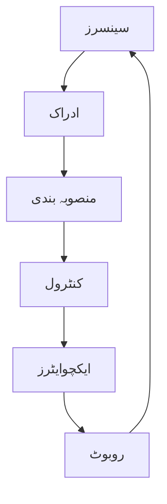

# سسٹم آرکیٹیکچر ڈائریگرام

## جسمانی AI سسٹم کا ڈائریگرام

### ڈائریگرام کی وضاحت

جسمانی AI سسٹم کا یہ ڈائریگرام ایک بند حلقہ (loop) کو ظاہر کرتا ہے جہاں روبوٹ مسلسل ماحول کا جائزہ لیتا ہے، اسے سمجھتا ہے، فیصلہ کرتا ہے، اور کارروائی کرتا ہے۔

- **سینسرز**: دنیا کے بارے میں معلومات فراہم کرتے ہیں
  - تصاویر، آواز، چھو، درجہ حرارت، اور دیگر حواس کی معلومات جمع کرتے ہیں
  - ماحول کا ڈیٹا اکٹھا کرتے ہیں

- **ادراک**: ماحول کو سمجھنے کا عمل
  - سینسرز کے ڈیٹا کو تبدیل کرکے مطلب (meaning) بناتے ہیں
  - اشیاء، افراد، اور ماحول کی پہچان کرتے ہیں
  - تاثرات کو حقائق میں تبدیل کرتے ہیں

- **منصوبہ بندی**: کام کرنے کا منصوبہ بنانا
  - کارروائی کا ایک سلسلہ تیار کرتے ہیں
  - اہداف کو ترتیب دیتے ہیں
  - بہترین راستہ چننے کے لیے سوچتے ہیں

- **کنٹرول**: اقدامات کا تعین کرنا
  - منصوبے کو عملی شکل دیتے ہیں
  - مخصوص حرکات کا تعین کرتے ہیں
  - وقت کے مطابق کارروائیوں کو مربوط کرتے ہیں

- **ایکچوایٹرز**: جسم کو حرکت دینا
  - میکانیکل حرکات پیدا کرتے ہیں
  - محرکات (motors) اور عمل انداز (actuators) کو چلاتے ہیں
  - جسم کو ماحول میں تبدیلیاں کرنے کی صلاحیت دیتے ہیں

- **روبوٹ**: جسمانی دنیا میں کام کرنا
  - تمام اجزاء کو ایک جامع نظام میں جوڑتا ہے
  - جسمانی دنیا میں کارروائیاں انجام دیتا ہے
  - اپنے اعمال کے نتائج کا مشاہدہ کرتا ہے

### حلقہ کا عمل

یہ نظام مسلسل چلتا رہتا ہے:
1. سینسرز ماحول کا جائزہ لیتے ہیں
2. ادراک معلومات کو سمجھتا ہے
3. منصوبہ بندی کارروائی کا فیصلہ کرتی ہے
4. کنٹرول اقدامات کا تعین کرتا ہے
5. ایکچوایٹرز جسم کو حرکت دیتے ہیں
6. روبوٹ کارروائی کرتا ہے اور نئے ماحول کا جائزہ لیتا ہے

یہ حلقہ روبوٹ کو ماحول کے ساتھ مسلسل تعامل کرنے کی اجازت دیتا ہے۔