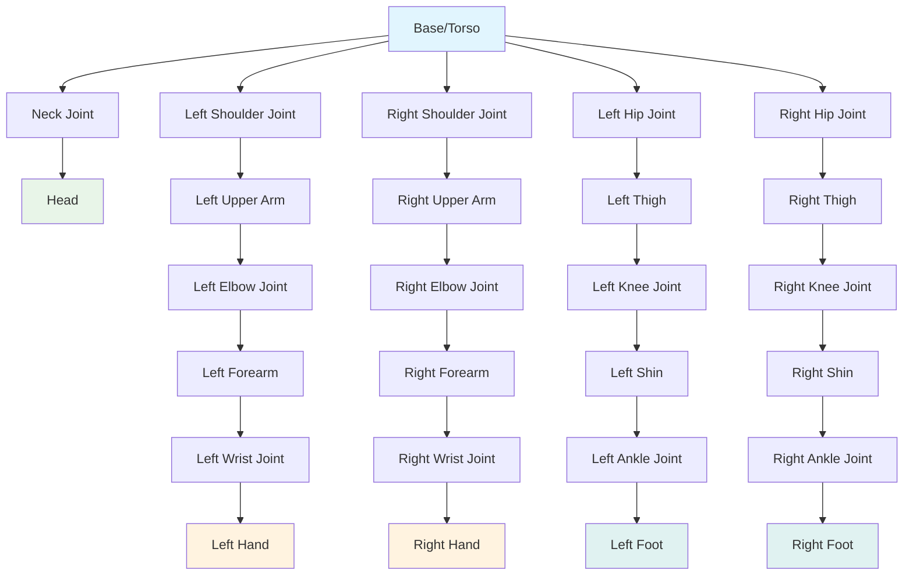
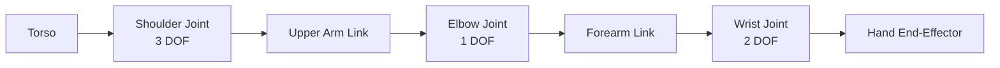
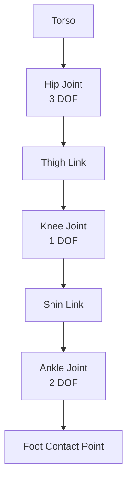

# Humanoid Kinematic Chain Diagram

## Overview

This diagram illustrates the kinematic structure of a typical humanoid robot, showing the hierarchical arrangement of joints and links that form the robot's body structure. The kinematic chain is fundamental to understanding how the robot moves and how inverse kinematics solutions are computed.

## Complete Humanoid Structure



## Upper Body Kinematic Chains

### Left Arm Chain


### Right Arm Chain


## Lower Body Kinematic Chains

### Left Leg Chain


### Right Leg Chain


## Degrees of Freedom Summary

| Body Part | Joints | DOF | Function |
|-----------|--------|-----|----------|
| Neck | 1 | 3 | Head orientation |
| Left Shoulder | 1 | 3 | Arm positioning |
| Left Elbow | 1 | 1 | Arm flexion/extension |
| Left Wrist | 1 | 2 | Hand orientation |
| Right Shoulder | 1 | 3 | Arm positioning |
| Right Elbow | 1 | 1 | Arm flexion/extension |
| Right Wrist | 1 | 2 | Hand orientation |
| Left Hip | 1 | 3 | Leg positioning |
| Left Knee | 1 | 1 | Leg flexion/extension |
| Left Ankle | 1 | 2 | Foot orientation |
| Right Hip | 1 | 3 | Leg positioning |
| Right Knee | 1 | 1 | Leg flexion/extension |
| Right Ankle | 1 | 2 | Foot orientation |

**Total DOF: 30** (excluding fingers and toes)

## Forward Kinematics Chain

The forward kinematics computes the position and orientation of each link based on joint angles:

```
T_0_to_n = T_0_to_1 * T_1_to_2 * T_2_to_3 * ... * T_n-1_to_n
```

Where each T_i_to_i+1 is the Denavit-Hartenberg transformation matrix for joint i.

## Inverse Kinematics Considerations

### Redundant Systems
- **Left Arm**: 7 DOF (typically) controlling 6 DOF (position + orientation) → 1 DOF redundancy
- **Right Arm**: 7 DOF (typically) controlling 6 DOF → 1 DOF redundancy
- **Whole Body**: 30+ DOF controlling multiple end-effectors and body pose

### Singularity Handling
- Occurs when Jacobian matrix becomes singular (determinant = 0)
- Results in loss of DOF in Cartesian space
- Requires special handling in control algorithms

## Balance and Center of Mass

### Support Polygon
- When standing: Convex hull of contact points (feet)
- When walking: Single foot during single support phase
- When both feet contact: Larger support area

### Zero Moment Point (ZMP)
- Point where net moment of ground reaction forces is zero
- Must remain within support polygon for stability
- Key parameter in walking pattern generation

## Applications

### Locomotion
- Walking pattern generation
- Balance control
- Obstacle avoidance

### Manipulation
- Reaching motions
- Grasping planning
- Tool use

### Interaction
- Gesture generation
- Posture control
- Social positioning

The humanoid kinematic chain provides the foundation for all motion planning and control in humanoid robotics. Understanding this structure is essential for implementing stable walking, manipulation, and human-like behaviors.