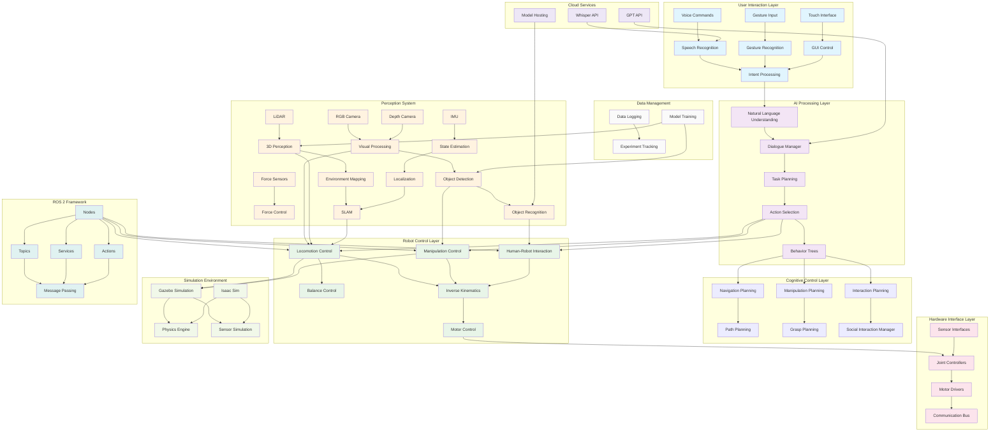
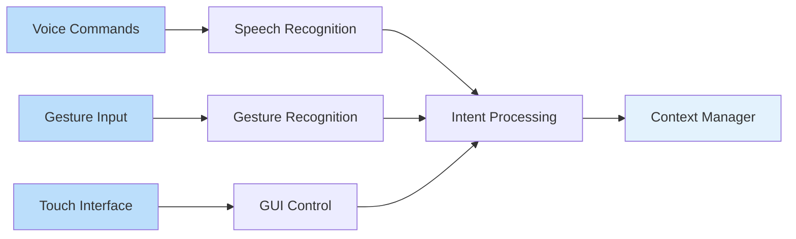
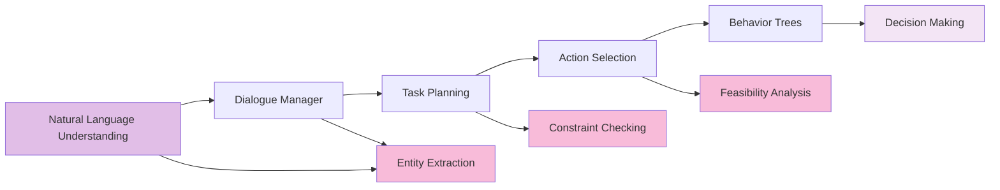
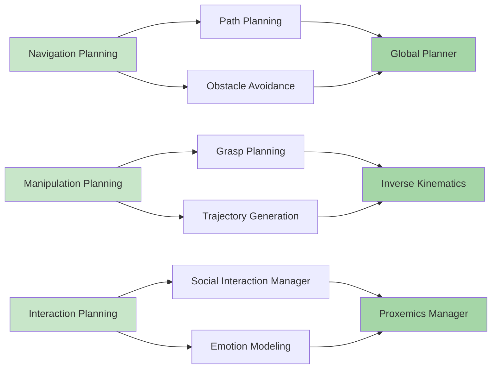
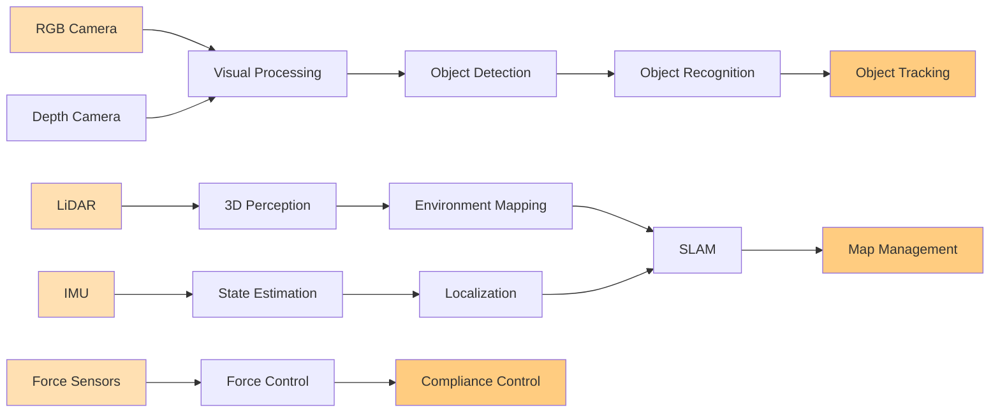
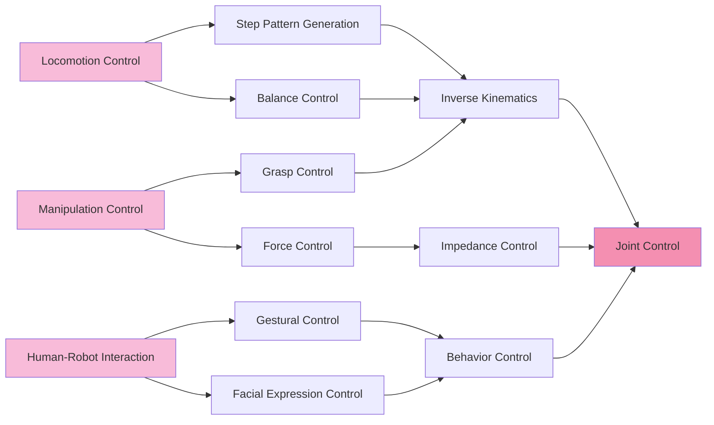
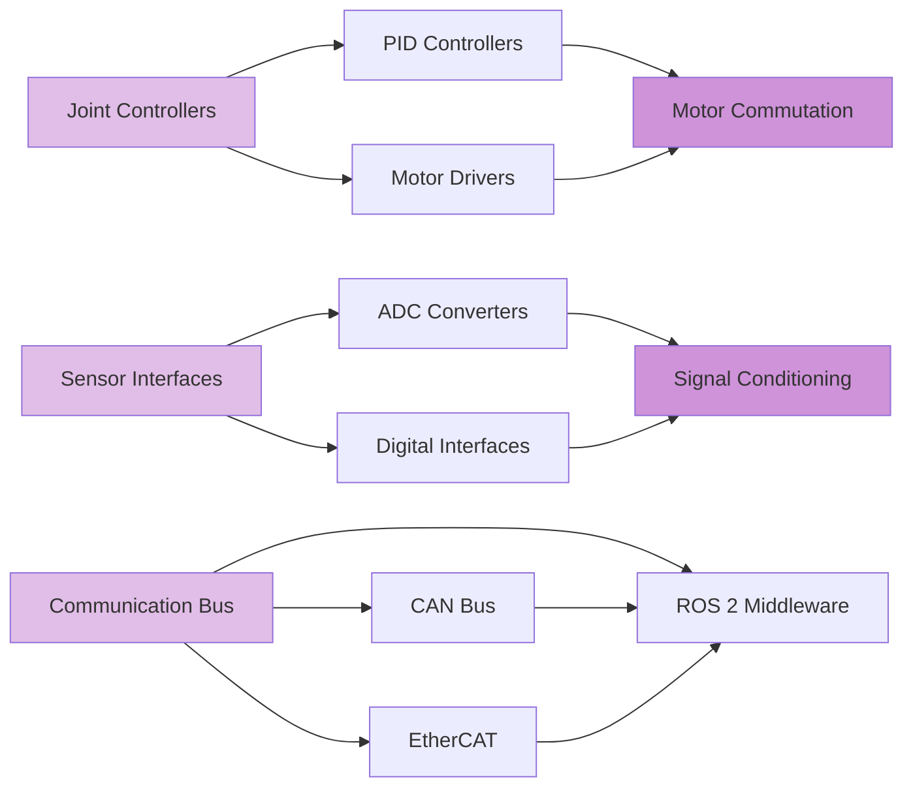
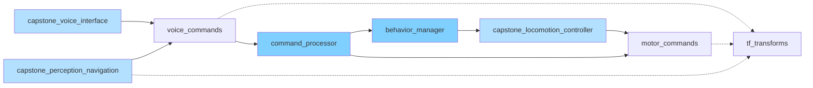
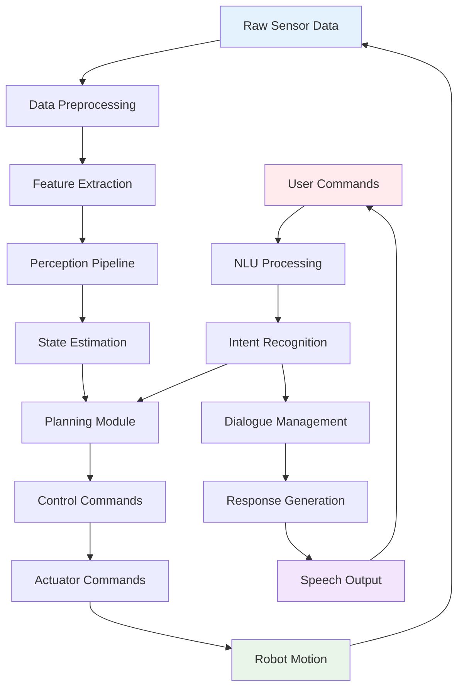

# Capstone Architecture Diagram

## Overview

This diagram illustrates the complete system architecture of the Physical AI Robot Assistant capstone project, showing how all components from the 13-week curriculum integrate into a cohesive system.

## Complete System Architecture

## Detailed Component Breakdown

### 1. User Interaction Layer

This layer handles all forms of human input, converting natural human expressions into structured commands that the robot can understand and process.

### 2. AI Processing Layer

The AI processing layer interprets user commands and translates them into executable robot behaviors, managing the complexity of natural language and high-level task planning.

### 3. Cognitive Control Layer

This layer handles the cognitive aspects of robot behavior, planning complex sequences of actions and managing the robot's interaction with its environment and humans.

### 4. Perception System

The perception system provides the robot with awareness of its environment, enabling it to understand and interact with the physical world around it.

### 5. Robot Control Layer

This layer manages the low-level control of the robot's physical movements, ensuring smooth and stable operation of all actuators and joints.

### 6. Hardware Interface Layer

The hardware interface layer provides the bridge between software commands and physical hardware, managing all low-level communication and control signals.

## Integration Points

### ROS 2 Communication Architecture

### Data Flow Architecture

## System Architecture Patterns

### 1. Component-Based Architecture

The system follows a component-based architecture where each major function is encapsulated in a separate, reusable component that can be developed, tested, and maintained independently.

### 2. Publish-Subscribe Pattern

Heavy use of ROS 2's publish-subscribe pattern for loose coupling between components, enabling flexible system configuration and easy component replacement.

### 3. Service-Client Pattern

For synchronous operations that require immediate responses, such as planning services or calibration procedures.

### 4. Action-Based Pattern

For long-running operations with feedback, such as navigation goals or manipulation tasks.

## Scalability Considerations

### Horizontal Scaling
- Multiple perception nodes for parallel processing
- Distributed computing for heavy AI workloads
- Modular component architecture for easy extension

### Vertical Scaling
- Optimized algorithms for real-time performance
- Hardware acceleration (GPU, FPGA) integration
- Efficient memory management

## Safety and Reliability

### 1. Fault Tolerance
- Component monitoring and restart mechanisms
- Graceful degradation when components fail
- Redundant safety systems

### 2. Safety Boundaries
- Physical limits enforcement
- Collision avoidance systems
- Emergency stop mechanisms

### 3. Error Recovery
- Automatic error detection and recovery
- Safe state transitions
- Logging and diagnostics

## Performance Metrics

### Real-Time Performance
- Perception pipeline: < 30ms latency
- Control loop: 100Hz minimum
- Voice response: < 2s from command to action

### Resource Utilization
- CPU: < 70% average utilization
- Memory: < 80% peak usage
- Power: Optimized for battery operation

This architecture provides a robust, scalable foundation for the Physical AI Robot Assistant, incorporating all concepts from the 13-week curriculum into a cohesive, functional system.