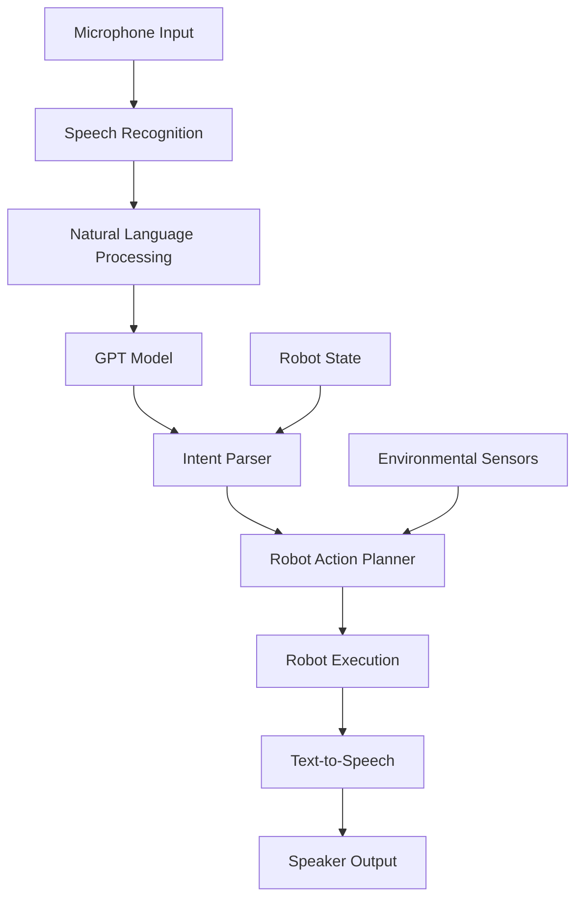

# GPT Integration for Robots

## Introduction to Conversational Robotics

Conversational robotics represents a significant advancement in human-robot interaction, enabling robots to understand and respond to natural language commands. By integrating Large Language Models (LLMs) like GPT with robotic systems, we can create more intuitive and natural interactions between humans and robots.

This chapter explores how to connect GPT models to robotic systems, creating voice-activated robots that can understand complex commands and respond appropriately with both verbal and physical actions.

## Architecture Overview

The architecture for GPT integration in robotics typically follows this flow:



## Setting Up OpenAI API Integration

First, let's create a basic GPT integration module for robotics:

```python
import openai
import json
import time
from typing import Dict, List, Optional, Any

class GPTRobotInterface:
    def __init__(self, api_key: str, model: str = "gpt-3.5-turbo"):
        """
        Initialize GPT integration for robot

        Args:
            api_key: OpenAI API key
            model: GPT model to use (gpt-3.5-turbo or gpt-4)
        """
        openai.api_key = api_key
        self.model = model
        self.conversation_history = []

        # Robot-specific context and capabilities
        self.robot_capabilities = {
            "navigation": ["move_forward", "turn_left", "turn_right", "move_to_location"],
            "manipulation": ["pick_up", "place_down", "open_gripper", "close_gripper"],
            "interaction": ["speak", "listen", "gesture", "display_message"],
            "sensors": ["camera", "lidar", "imu", "force_torque_sensors"]
        }

    def set_robot_context(self, robot_name: str, robot_type: str, capabilities: Dict):
        """
        Set robot-specific context for better GPT responses
        """
        self.robot_context = {
            "name": robot_name,
            "type": robot_type,
            "capabilities": capabilities,
            "current_location": "unknown",
            "battery_level": 100,
            "available_actions": self._get_available_actions()
        }

    def _get_available_actions(self) -> List[str]:
        """Get list of all available robot actions"""
        actions = []
        for category, funcs in self.robot_capabilities.items():
            actions.extend(funcs)
        return actions

    def _create_system_prompt(self) -> str:
        """Create system prompt with robot context"""
        return f"""
        You are {self.robot_context['name']}, a {self.robot_context['type']} robot.

        Your capabilities include:
        - Navigation: {', '.join(self.robot_capabilities['navigation'])}
        - Manipulation: {', '.join(self.robot_capabilities['manipulation'])}
        - Interaction: {', '.join(self.robot_capabilities['interaction'])}
        - Sensors: {', '.join(self.robot_capabilities['sensors'])}

        Current status:
        - Location: {self.robot_context['current_location']}
        - Battery: {self.robot_context['battery_level']}%

        When responding to user requests:
        1. Understand the intent from natural language
        2. Respond with appropriate robot actions in JSON format
        3. If uncertain, ask for clarification
        4. Always consider safety and feasibility
        5. Respond in a helpful, friendly tone
        """

    def process_command(self, user_input: str) -> Dict[str, Any]:
        """
        Process user command and return robot actions

        Args:
            user_input: Natural language command from user

        Returns:
            Dictionary containing response and actions to execute
        """
        # Create messages for GPT
        messages = [
            {"role": "system", "content": self._create_system_prompt()},
        ]

        # Add conversation history
        messages.extend(self.conversation_history)

        # Add current user input
        messages.append({"role": "user", "content": user_input})

        try:
            response = openai.ChatCompletion.create(
                model=self.model,
                messages=messages,
                temperature=0.7,
                max_tokens=500
            )

            gpt_response = response.choices[0].message.content

            # Parse the response for robot actions
            robot_actions = self._extract_actions(gpt_response)

            # Update conversation history
            self.conversation_history.append({"role": "user", "content": user_input})
            self.conversation_history.append({"role": "assistant", "content": gpt_response})

            # Keep only last 10 exchanges to prevent history from growing too large
            if len(self.conversation_history) > 20:
                self.conversation_history = self.conversation_history[-20:]

            return {
                "response_text": gpt_response,
                "actions": robot_actions,
                "success": True
            }

        except Exception as e:
            return {
                "response_text": f"Sorry, I encountered an error: {str(e)}",
                "actions": [],
                "success": False
            }

    def _extract_actions(self, text: str) -> List[Dict]:
        """
        Extract robot actions from GPT response
        This is a simplified implementation - in practice, you'd want more robust parsing
        """
        actions = []

        # Look for JSON-formatted actions
        import re
        json_matches = re.findall(r'\{[^{}]*\}', text)

        for match in json_matches:
            try:
                action = json.loads(match)
                if isinstance(action, dict) and 'action' in action:
                    actions.append(action)
            except json.JSONDecodeError:
                continue

        # If no JSON found, try to parse simple commands
        if not actions:
            text_lower = text.lower()

            # Simple command detection
            if "move forward" in text_lower:
                actions.append({"action": "move_forward", "distance": 1.0})
            elif "turn left" in text_lower:
                actions.append({"action": "turn_left", "angle": 90})
            elif "turn right" in text_lower:
                actions.append({"action": "turn_right", "angle": 90})
            elif "speak" in text_lower or "say" in text_lower:
                # Extract what to say
                import re
                say_match = re.search(r'"([^"]*)"', text) or re.search(r"'([^']*)'", text)
                if say_match:
                    actions.append({"action": "speak", "text": say_match.group(1)})

        return actions

# Example usage
def example_usage():
    # Initialize the interface (replace with your actual API key)
    robot_interface = GPTRobotInterface(api_key="your-api-key-here")

    # Set robot context
    robot_interface.set_robot_context(
        robot_name="Robbie",
        robot_type="humanoid",
        capabilities={
            "navigation": True,
            "manipulation": True,
            "interaction": True
        }
    )

    # Process a command
    user_command = "Please move forward 2 meters and then turn left"
    result = robot_interface.process_command(user_command)

    print(f"Response: {result['response_text']}")
    print(f"Actions: {result['actions']}")

    return result
```

## Voice Command Processing

For conversational robotics, we need to integrate speech recognition and text-to-speech capabilities:

```python
import speech_recognition as sr
import pyttsx3
import threading
import queue
import time

class VoiceCommandProcessor:
    def __init__(self, gpt_interface: GPTRobotInterface):
        """
        Initialize voice command processor

        Args:
            gpt_interface: Instance of GPTRobotInterface
        """
        self.gpt_interface = gpt_interface
        self.recognizer = sr.Recognizer()
        self.microphone = sr.Microphone()

        # Initialize text-to-speech engine
        self.tts_engine = pyttsx3.init()

        # Set TTS properties
        self.tts_engine.setProperty('rate', 150)  # Speed of speech
        self.tts_engine.setProperty('volume', 0.9)  # Volume level (0.0 to 1.0)

        # Queue for processing commands
        self.command_queue = queue.Queue()
        self.listening = False

        # Adjust for ambient noise
        with self.microphone as source:
            self.recognizer.adjust_for_ambient_noise(source)

    def listen_continuously(self):
        """
        Start continuous listening for voice commands
        """
        self.listening = True
        print("Starting to listen for voice commands...")

        while self.listening:
            try:
                with self.microphone as source:
                    print("Listening...")
                    audio = self.recognizer.listen(source, timeout=5, phrase_time_limit=10)

                # Recognize speech
                text = self.recognizer.recognize_google(audio)
                print(f"Heard: {text}")

                # Process the command
                self.process_voice_command(text)

            except sr.WaitTimeoutError:
                # Timeout - continue listening
                continue
            except sr.UnknownValueError:
                self.speak("Sorry, I didn't understand that. Could you repeat?")
            except sr.RequestError as e:
                print(f"Error with speech recognition service: {e}")
                self.speak("Sorry, I'm having trouble connecting to the speech service.")
            except KeyboardInterrupt:
                print("Stopping voice command processor...")
                break

    def process_voice_command(self, command: str):
        """
        Process a voice command through GPT and execute actions
        """
        # Process command through GPT
        result = self.gpt_interface.process_command(command)

        if result['success']:
            # Speak the response
            self.speak(result['response_text'])

            # Execute robot actions if any
            if result['actions']:
                self.execute_robot_actions(result['actions'])
        else:
            self.speak("Sorry, I encountered an error processing your request.")

    def speak(self, text: str):
        """
        Speak text using text-to-speech
        """
        print(f"Speaking: {text}")
        self.tts_engine.say(text)
        self.tts_engine.runAndWait()

    def execute_robot_actions(self, actions: List[Dict]):
        """
        Execute robot actions (this would interface with actual robot controls)
        """
        for action in actions:
            action_type = action.get('action')
            print(f"Executing action: {action_type}")

            # In a real implementation, this would call actual robot functions
            if action_type == 'speak':
                self.speak(action.get('text', ''))
            elif action_type == 'move_forward':
                distance = action.get('distance', 1.0)
                print(f"Moving forward {distance} meters")
                # self.robot.move_forward(distance)
            elif action_type == 'turn_left':
                angle = action.get('angle', 90)
                print(f"Turning left {angle} degrees")
                # self.robot.turn_left(angle)
            elif action_type == 'turn_right':
                angle = action.get('angle', 90)
                print(f"Turning right {angle} degrees")
                # self.robot.turn_right(angle)
            # Add more action handlers as needed

    def stop_listening(self):
        """
        Stop the continuous listening
        """
        self.listening = False

# Example usage of voice command processor
def voice_example():
    # Initialize GPT interface (you'd need a real API key)
    gpt_interface = GPTRobotInterface(api_key="your-api-key-here")
    gpt_interface.set_robot_context(
        robot_name="Robbie",
        robot_type="humanoid",
        capabilities={
            "navigation": True,
            "manipulation": True,
            "interaction": True
        }
    )

    # Initialize voice command processor
    voice_processor = VoiceCommandProcessor(gpt_interface)

    # Start listening (this will run continuously until interrupted)
    try:
        voice_processor.listen_continuously()
    except KeyboardInterrupt:
        print("Stopping...")
        voice_processor.stop_listening()
```

## ROS 2 Integration

For integration with ROS 2, we can create a node that bridges GPT responses to ROS 2 actions:

```python
import rclpy
from rclpy.node import Node
from std_msgs.msg import String
from geometry_msgs.msg import Twist
from sensor_msgs.msg import Image
import json

class GPTROS2Bridge(Node):
    def __init__(self):
        super().__init__('gpt_ros2_bridge')

        # Initialize GPT interface
        # self.gpt_interface = GPTRobotInterface(api_key="your-api-key-here")

        # Publishers
        self.cmd_vel_publisher = self.create_publisher(Twist, 'cmd_vel', 10)
        self.speech_publisher = self.create_publisher(String, 'tts_input', 10)

        # Subscribers
        self.voice_command_subscriber = self.create_subscription(
            String,
            'voice_command',
            self.voice_command_callback,
            10
        )

        self.get_logger().info('GPT-ROS2 Bridge node started')

    def voice_command_callback(self, msg):
        """
        Process voice command through GPT and execute ROS 2 actions
        """
        command = msg.data
        self.get_logger().info(f'Received voice command: {command}')

        # Process through GPT (commented out to avoid API dependency)
        # result = self.gpt_interface.process_command(command)
        #
        # if result['success']:
        #     self.execute_ros2_actions(result['actions'])

        # For demonstration, we'll handle simple commands directly
        self.handle_simple_command(command)

    def handle_simple_command(self, command):
        """
        Handle simple commands without GPT (for demonstration)
        """
        command_lower = command.lower()

        if 'forward' in command_lower or 'move forward' in command_lower:
            self.move_forward()
        elif 'backward' in command_lower or 'move backward' in command_lower:
            self.move_backward()
        elif 'left' in command_lower or 'turn left' in command_lower:
            self.turn_left()
        elif 'right' in command_lower or 'turn right' in command_lower:
            self.turn_right()
        elif 'stop' in command_lower:
            self.stop_robot()
        else:
            self.speak(f"I heard: {command}. I'm not sure how to respond to that.")

    def move_forward(self):
        """Move robot forward"""
        msg = Twist()
        msg.linear.x = 0.5  # Forward velocity
        self.cmd_vel_publisher.publish(msg)
        self.get_logger().info('Moving forward')

    def move_backward(self):
        """Move robot backward"""
        msg = Twist()
        msg.linear.x = -0.5  # Backward velocity
        self.cmd_vel_publisher.publish(msg)
        self.get_logger().info('Moving backward')

    def turn_left(self):
        """Turn robot left"""
        msg = Twist()
        msg.angular.z = 0.5  # Angular velocity (left turn)
        self.cmd_vel_publisher.publish(msg)
        self.get_logger().info('Turning left')

    def turn_right(self):
        """Turn robot right"""
        msg = Twist()
        msg.angular.z = -0.5  # Angular velocity (right turn)
        self.cmd_vel_publisher.publish(msg)
        self.get_logger().info('Turning right')

    def stop_robot(self):
        """Stop robot movement"""
        msg = Twist()
        # Zero velocities
        self.cmd_vel_publisher.publish(msg)
        self.get_logger().info('Stopping robot')

    def speak(self, text):
        """Publish text for speech synthesis"""
        msg = String()
        msg.data = text
        self.speech_publisher.publish(msg)
        self.get_logger().info(f'Speaking: {text}')

def main(args=None):
    rclpy.init(args=args)
    gpt_bridge = GPTROS2Bridge()

    try:
        rclpy.spin(gpt_bridge)
    except KeyboardInterrupt:
        pass
    finally:
        gpt_bridge.destroy_node()
        rclpy.shutdown()

if __name__ == '__main__':
    main()
```

## Security and Privacy Considerations

When integrating GPT with robots, security and privacy are paramount:

```python
import hashlib
import hmac
import secrets
from cryptography.fernet import Fernet

class SecureGPTInterface:
    def __init__(self, api_key: str):
        """
        Secure GPT interface with privacy protections
        """
        self.api_key = api_key
        self.encryption_key = Fernet.generate_key()
        self.cipher_suite = Fernet(self.encryption_key)

        # Initialize rate limiting
        self.request_counts = {}
        self.rate_limit = 10  # requests per minute per user
        self.rate_limit_window = 60  # seconds

    def anonymize_user_input(self, user_input: str) -> str:
        """
        Anonymize sensitive information from user input
        """
        import re

        # Remove potential email addresses
        user_input = re.sub(r'\b[A-Za-z0-9._%+-]+@[A-Za-z0-9.-]+\.[A-Z|a-z]{2,}\b',
                           '[EMAIL_REMOVED]', user_input)

        # Remove potential phone numbers
        user_input = re.sub(r'\b\d{3}[-.]?\d{3}[-.]?\d{4}\b', '[PHONE_REMOVED]', user_input)

        # Remove potential personal names (simple approach)
        # In practice, you'd use more sophisticated NLP
        user_input = re.sub(r'\b[A-Z][a-z]+\s[A-Z][a-z]+\b', '[NAME_REMOVED]', user_input)

        return user_input

    def check_rate_limit(self, user_id: str) -> bool:
        """
        Check if user has exceeded rate limit
        """
        current_time = time.time()

        if user_id not in self.request_counts:
            self.request_counts[user_id] = []

        # Remove requests older than the rate limit window
        self.request_counts[user_id] = [
            req_time for req_time in self.request_counts[user_id]
            if current_time - req_time < self.rate_limit_window
        ]

        # Check if user is within rate limit
        if len(self.request_counts[user_id]) >= self.rate_limit:
            return False

        # Add current request
        self.request_counts[user_id].append(current_time)
        return True

    def encrypt_conversation(self, conversation_data: Dict) -> bytes:
        """
        Encrypt conversation data before storage
        """
        import json
        json_data = json.dumps(conversation_data).encode()
        encrypted_data = self.cipher_suite.encrypt(json_data)
        return encrypted_data

    def decrypt_conversation(self, encrypted_data: bytes) -> Dict:
        """
        Decrypt conversation data
        """
        decrypted_data = self.cipher_suite.decrypt(encrypted_data)
        return json.loads(decrypted_data.decode())
```

## Best Practices for GPT Integration

When integrating GPT models with robotic systems, consider these best practices:

1. **Safety First**: Always validate GPT-generated actions before execution
2. **Fallback Mechanisms**: Have manual override capabilities
3. **Privacy Protection**: Don't send sensitive data to external APIs
4. **Latency Considerations**: Cache responses when possible for real-time applications
5. **Error Handling**: Graceful degradation when GPT service is unavailable
6. **Context Management**: Maintain conversation state appropriately
7. **Testing**: Thoroughly test all possible command interpretations

## Summary

GPT integration with robotic systems opens up new possibilities for natural human-robot interaction. By combining language understanding with robot action execution, we can create more intuitive and accessible robotic interfaces. The key is to maintain safety, privacy, and reliability while leveraging the power of large language models for enhanced user experience.